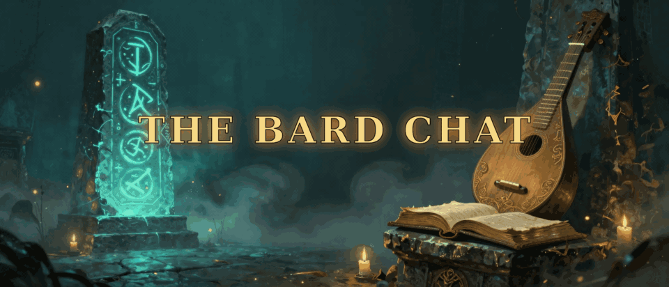

<p align="center">
  
</p>

> **3D avatar showcase →** see the rotating live 3D model on the [GitHub Pages site](https://thebardchat.github.io/horizon-meta-profile/). It's currently a placeholder; the real `.glb` mesh is queued to render on **2026-05-09** once Hugging Face quota resets (the scheduled follow-up agent will generate a full-body bard image, run it through TRELLIS / SAM3D-Body to produce a true 3D mesh, and the Pages page will auto-render it via `<model-viewer>`).

# The Bard Chat — in Horizon Worlds

A creator presence inside Meta Horizon Worlds for [@thebardchat](https://github.com/thebardchat).

## Find me in Horizon

[**horizon.meta.com/profile/702118972988489**](https://horizon.meta.com/profile/702118972988489/)

Drop in, say hi, follow if it sparks something.

## The Bard Chat operates under our constitution

**The Bard Chat operates under our constitution** — [our by-laws and standards live here](https://github.com/thebardchat/constitution).

## Help promote

If you want to give The Bard Chat a boost in Horizon, you don't need a headset:

- Open the profile link above on web or your phone and tap **Follow**
- Share the link to anyone who's into VR, storytelling, or AI experiments — see [`promotion/share-kit.md`](promotion/share-kit.md) for ready-to-paste copy
- For close friends/family who want a quick "what do I do" — see [`promotion/friend-pitch.md`](promotion/friend-pitch.md)

## What's in this repo

```
.
├── README.md                    you are here
├── assets/
│   ├── banner.gif               the animated banner above
│   ├── banner-source/           frames + prompts for re-rendering
│   ├── avatar-refs/             concept art for the Meta avatar
│   └── social-cards/            1200×630 share images
├── profile/
│   ├── profile-copy.md          display name, bio variants, link list
│   ├── setup-walkthrough.md     headset-less click-path to configure the profile
│   ├── privacy-checklist.md     every privacy toggle, recommended setting
│   └── wearables-submission.md  Meta Avatars Store creator-program playbook
├── promotion/
│   ├── share-kit.md             paste-ready copy for X / IG / threads / email
│   ├── friend-pitch.md          3-line ask for friends and family
│   └── tracking.md              notes on Horizon's built-in share params
└── worlds/
    └── README.md                placeholder for future Horizon Worlds builds
```

## Other thebardchat surfaces

- GitHub org — [github.com/thebardchat](https://github.com/thebardchat)
- Hugging Face — [huggingface.co/thebardchat](https://huggingface.co/thebardchat)
- Constitution — [github.com/thebardchat/constitution](https://github.com/thebardchat/constitution)
- Horizon Worlds — [horizon.meta.com/profile/702118972988489](https://horizon.meta.com/profile/702118972988489/)
